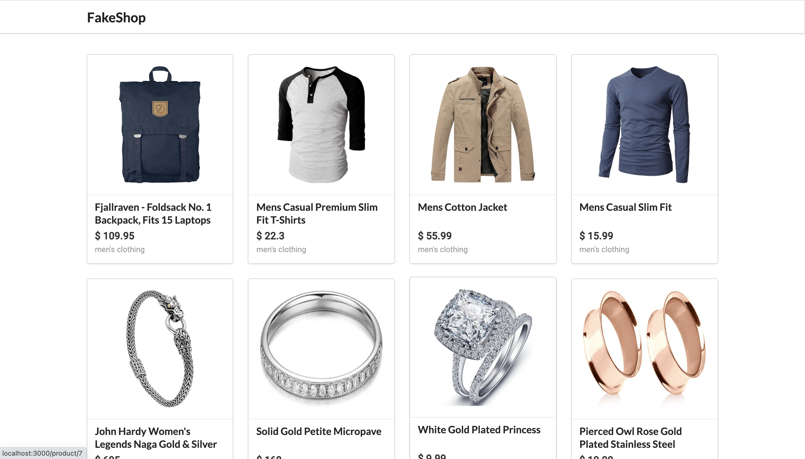
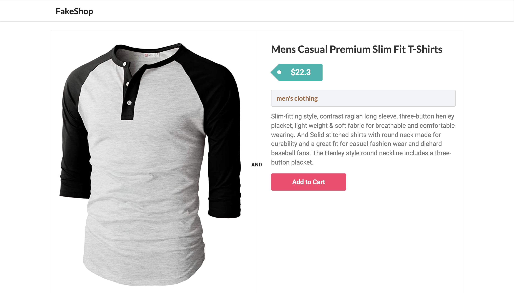

# fakeshop-project-with-react-redux

learning React-Redux with project

---

What I used in this project

-   [x] React-Redux
-   [x] Redux-Axios
-   [x] React-router-dom
-   [x] semantic UI
-   [x] Redux dev tool extension

